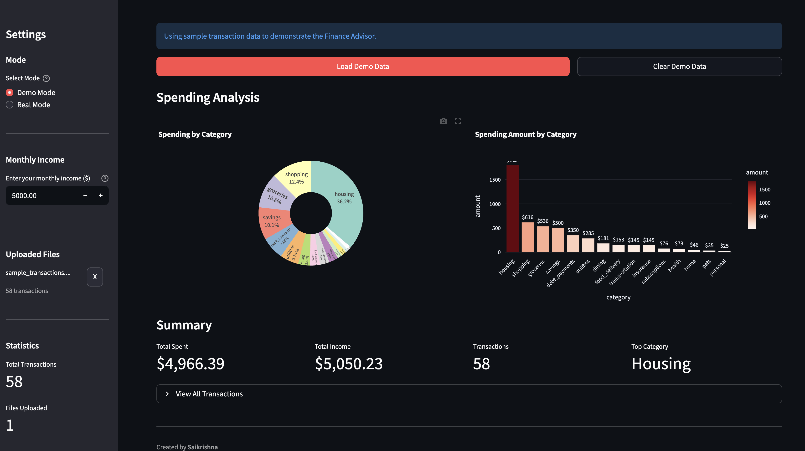

<p align="center">
  
</p>

<h1 align="center">Finance Advisor AI Agent</h1>

<p align="center">
  <strong>Your Personal AI-Powered Financial Assistant</strong>
</p>

<p align="center">
  <a href="#features">Features</a> •
  <a href="#demo">Demo</a> •
  <a href="#architecture">Architecture</a> •
  <a href="#installation">Installation</a> •
  <a href="#usage">Usage</a> •
  <a href="#tech-stack">Tech Stack</a>
</p>

<p align="center">
  
  
  
  
  
</p>

<p align="center">
  
  
  
</p>

---

## Overview

An intelligent personal finance advisor that uses **RAG (Retrieval-Augmented Generation)** to analyze your bank transactions and provide personalized financial insights. Ask natural language questions about your spending and get instant, accurate answers.

```
You: "How much did I spend on food this month?"

Finley: "You spent $847 on food this month:
         • Groceries: $536 (63%)
         • Dining: $153 (18%)
         • Food Delivery: $158 (19%)

         This is 17% of your monthly income.
         Tip: Consider meal prepping to reduce dining expenses!"
```

---

## Features

| Feature | Description |
|---------|-------------|
| 💬 **Natural Language Chat** | Ask questions in plain English about your finances |
| 📊 **Smart Categorization** | Auto-categorizes transactions into 16+ categories |
| 📈 **Visual Analytics** | Interactive pie & bar charts for spending breakdown |
| 📄 **PDF Processing** | Extract transactions from bank statement PDFs |
| 💾 **Cloud Storage** | Persistent vector storage with Qdrant Cloud |
| 🎯 **Income-Aware** | Insights relative to your monthly income |
| 🔒 **Privacy First** | Your data stays in your own Qdrant cluster |

---

## Dashboard

<p align="center">
  
  <br>
  <em>Dashboard - Spending analytics with interactive charts</em>
</p>

---

### Chat Interface
Ask natural questions and get intelligent, personalized responses:

```
✅ "What are my biggest expenses?"
✅ "How much did I spend on subscriptions?"
✅ "Can I afford a $500 purchase?"
✅ "Where does my money go?"
✅ "Show me my grocery spending"
```

### Spending Analytics
Visual breakdown of your spending by category with interactive charts.

---

## Architecture

```
┌────────────────────────────────────────────────────────────────────────────┐
│                           STREAMLIT UI                                      │
│  ┌─────────────────┐  ┌─────────────────┐  ┌─────────────────────────────┐ │
│  │   Demo Mode     │  │   Real Mode     │  │      Chat Interface         │ │
│  │   (CSV Data)    │  │  (PDF Upload)   │  │   (Natural Language Q&A)    │ │
│  └────────┬────────┘  └────────┬────────┘  └──────────────┬──────────────┘ │
└───────────┼─────────────────────┼──────────────────────────┼────────────────┘
            │                     │                          │
            ▼                     ▼                          ▼
┌────────────────────────────────────────────────────────────────────────────┐
│                         PROCESSING LAYER                                    │
│  ┌─────────────────┐  ┌─────────────────┐  ┌─────────────────────────────┐ │
│  │   CSV Parser    │  │  PDF Processor  │  │  Transaction Categorizer    │ │
│  │                 │  │  (pdfplumber)   │  │   (Keyword Matching)        │ │
│  └────────┬────────┘  └────────┬────────┘  └──────────────┬──────────────┘ │
└───────────┼─────────────────────┼──────────────────────────┼────────────────┘
            │                     │                          │
            └─────────────────────┼──────────────────────────┘
                                  ▼
┌────────────────────────────────────────────────────────────────────────────┐
│                           RAG ENGINE                                        │
│  ┌──────────────────────────────────────────────────────────────────────┐  │
│  │                        LlamaIndex                                     │  │
│  │  ┌──────────────┐  ┌──────────────┐  ┌────────────────────────────┐  │  │
│  │  │  Embeddings  │  │  Retriever   │  │     Query Engine           │  │  │
│  │  │  (MiniLM)    │  │  (Top-K=20)  │  │     (Context Builder)      │  │  │
│  │  └──────┬───────┘  └──────┬───────┘  └─────────────┬──────────────┘  │  │
│  └─────────┼─────────────────┼────────────────────────┼──────────────────┘  │
└────────────┼─────────────────┼────────────────────────┼─────────────────────┘
             │                 │                        │
             ▼                 ▼                        ▼
┌────────────────────┐  ┌───────────────────┐  ┌─────────────────────────────┐
│   Qdrant Cloud     │  │   User Profile    │  │         Groq API            │
│  (Vector Storage)  │  │     (JSON)        │  │    (Llama 3.3 70B)          │
│                    │  │                   │  │                             │
│  • 384-dim vectors │  │  • Monthly income │  │  • Fast inference           │
│  • Payload index   │  │  • File tracking  │  │  • Low latency              │
│  • Semantic search │  │  • Settings       │  │  • Smart responses          │
└────────────────────┘  └───────────────────┘  └─────────────────────────────┘
```

### How RAG Works

```
1. USER QUERY          2. SEMANTIC SEARCH       3. CONTEXT BUILDING      4. LLM RESPONSE
─────────────────      ─────────────────        ─────────────────        ─────────────────
"How much on food?"    Search vectors for       Build context from       Generate intelligent
        │              food-related txns        retrieved data           response with Groq
        │                     │                        │                        │
        ▼                     ▼                        ▼                        ▼
   ┌─────────┐          ┌─────────┐            ┌─────────────┐          ┌─────────────┐
   │  Query  │ ───────► │ Qdrant  │ ─────────► │  20 Relevant │ ───────► │   Finley    │
   │         │          │ Cloud   │            │  Transactions│          │  Response   │
   └─────────┘          └─────────┘            └─────────────┘          └─────────────┘
```

---

## Tech Stack

<table>
<tr>
<td align="center" width="120">

<br><strong>Python</strong>
<br><sub>3.9+</sub>
</td>
<td align="center" width="120">

<br><strong>Streamlit</strong>
<br><sub>UI Framework</sub>
</td>
<td align="center" width="120">

<br><strong>LlamaIndex</strong>
<br><sub>RAG Framework</sub>
</td>
<td align="center" width="120">

<br><strong>Qdrant</strong>
<br><sub>Vector DB</sub>
</td>
<td align="center" width="120">

<br><strong>Groq</strong>
<br><sub>LLM Inference</sub>
</td>
</tr>
</table>

| Component | Technology | Purpose |
|-----------|------------|---------|
| **LLM** | Groq (Llama 3.3 70B) | Fast, intelligent response generation |
| **RAG Framework** | LlamaIndex 0.10+ | Document indexing & retrieval |
| **Vector Database** | Qdrant Cloud | Semantic search & storage |
| **Embeddings** | HuggingFace MiniLM | Local, free text embeddings |
| **Frontend** | Streamlit | Interactive chat interface |
| **PDF Processing** | pdfplumber, PyMuPDF | Bank statement extraction |
| **Visualization** | Plotly | Interactive spending charts |

---

## Project Structure

```
01-finance-advisor-agent/
├── 📁 app/
│   └── streamlit_app.py       # Main Streamlit application
│
├── 📁 src/
│   ├── config.py              # Configuration & environment
│   ├── pdf_processor.py       # PDF/CSV data extraction
│   ├── categorizer.py         # Transaction categorization
│   ├── vector_store.py        # Qdrant vector operations
│   ├── query_engine.py        # RAG query engine + Groq
│   └── user_profile.py        # User data persistence
│
├── 📁 data/
│   ├── categories.json        # Category definitions (16 categories)
│   ├── sample_transactions.csv # Demo transaction data
│   └── user_profile.json      # User settings & file tracking
│
├── 📁 images/                 # Screenshots for README
│   └── demo-mode.png          # Dashboard screenshot
│
├── .env.example               # Environment template
├── requirements.txt           # Python dependencies
└── README.md                  # This file
```

---

## Installation

### Prerequisites

- Python 3.9 or higher
- [Groq API Key](https://console.groq.com/keys) (Free tier available)
- [Qdrant Cloud Account](https://cloud.qdrant.io/) (Free tier available)

### Step 1: Clone Repository

```bash
git clone https://github.com/yourusername/finance-advisor-agent.git
cd finance-advisor-agent
```

### Step 2: Create Virtual Environment

```bash
python -m venv venv
source venv/bin/activate  # Windows: venv\Scripts\activate
```

### Step 3: Install Dependencies

```bash
pip install -r requirements.txt
```

### Step 4: Configure Environment

```bash
cp .env.example .env
```

Edit `.env` with your credentials:

```env
# Groq API (Required)
GROQ_API_KEY=gsk_your_api_key_here
GROQ_MODEL=llama-3.3-70b-versatile

# Qdrant Cloud (Required)
QDRANT_URL=https://your-cluster.qdrant.io
QDRANT_API_KEY=your_qdrant_api_key
QDRANT_COLLECTION=finance_advisor_transactions

# Embeddings (Local - No API needed)
EMBEDDING_MODEL=sentence-transformers/all-MiniLM-L6-v2
```

### Step 5: Run Application

```bash
streamlit run app/streamlit_app.py
```

Open http://localhost:8501 in your browser.

---

## Usage

### Demo Mode (Quick Start)

1. Select **"Demo Mode"** in sidebar
2. Go to **"Data Management"** tab
3. Click **"Load Demo Data"**
4. Switch to **"Chat"** tab
5. Start asking questions!

### Real Mode (Your Data)

1. Select **"Real Mode"** in sidebar
2. Upload your bank statement PDF
3. System extracts & categorizes transactions
4. Chat with your actual financial data

### Example Conversations

```
You: Hello!
Finley: Hey! I'm Finley, your personal finance advisor. How can I help you today?

You: How much did I spend on food?
Finley: You spent $847 on food this month, which is 17% of your income...

You: What are my biggest expenses?
Finley: Your top 3 expenses are:
        1. Housing: $1,500 (30%)
        2. Groceries: $536 (11%)
        3. Shopping: $423 (8%)

You: Can I afford a $300 purchase?
Finley: Based on your spending patterns, you have approximately $340 monthly surplus...
```

---

## Customization

### Adding Categories

Edit `data/categories.json`:

```json
{
  "categories": {
    "your_category": {
      "keywords": ["keyword1", "keyword2"],
      "icon": "🎯"
    }
  }
}
```

### Supported Categories (16)

| Category | Icon | Examples |
|----------|------|----------|
| Income | 💰 | Salary, Direct Deposit |
| Housing | 🏠 | Rent, Mortgage |
| Utilities | 💡 | Electric, Internet |
| Groceries | 🛒 | Walmart, Kroger |
| Dining | 🍽️ | Restaurants, Coffee |
| Food Delivery | 🚗🍔 | DoorDash, Uber Eats |
| Transportation | 🚗 | Uber, Gas Stations |
| Subscriptions | 📺 | Netflix, Spotify |
| Shopping | 🛍️ | Amazon, Target |
| Health | 🏥 | Pharmacy, Gym |
| Insurance | 🛡️ | Geico, State Farm |
| Debt Payments | 💳 | Loans, Credit Cards |
| Savings | 🐷 | 401k, Investments |
| Pets | 🐕 | Petco, Vet |
| Home | 🔧 | Home Depot, IKEA |
| Personal | 👤 | Venmo, Zelle |

---

## API Keys Setup

### Groq (LLM)

1. Go to [console.groq.com](https://console.groq.com/keys)
2. Sign up for free account
3. Create API key
4. Add to `.env` as `GROQ_API_KEY`

### Qdrant Cloud (Vector DB)

1. Go to [cloud.qdrant.io](https://cloud.qdrant.io/)
2. Create free cluster
3. Copy cluster URL and API key
4. Add to `.env` as `QDRANT_URL` and `QDRANT_API_KEY`

---

## Roadmap

- [ ] Multi-month trend analysis
- [ ] Budget setting & alerts
- [ ] Recurring transaction detection
- [ ] Export reports to PDF
- [ ] Multiple bank support
- [ ] Savings recommendations
- [ ] Bill reminder notifications
- [ ] Investment tracking

---

## Contributing

Contributions are welcome! Please feel free to submit a Pull Request.

1. Fork the repository
2. Create your feature branch (`git checkout -b feature/AmazingFeature`)
3. Commit your changes (`git commit -m 'Add some AmazingFeature'`)
4. Push to the branch (`git push origin feature/AmazingFeature`)
5. Open a Pull Request

---

## License

This project is licensed under the MIT License - see the [LICENSE](LICENSE) file for details.

---

## Acknowledgments

- [LlamaIndex](https://www.llamaindex.ai/) - RAG framework
- [Qdrant](https://qdrant.tech/) - Vector database
- [Groq](https://groq.com/) - Fast LLM inference
- [Streamlit](https://streamlit.io/) - Web framework

---

<p align="center">
  <strong>Built with ❤️ by Saikrishna</strong>
</p>

<p align="center">
  <sub>Project 1 of <a href="#">12 AI Projects for 2025</a></sub>
</p>
